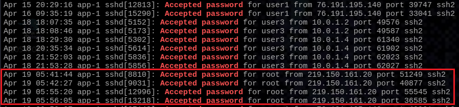
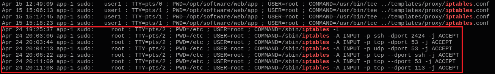
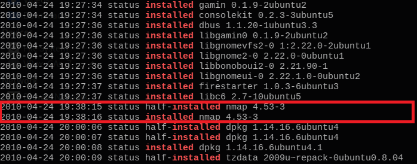
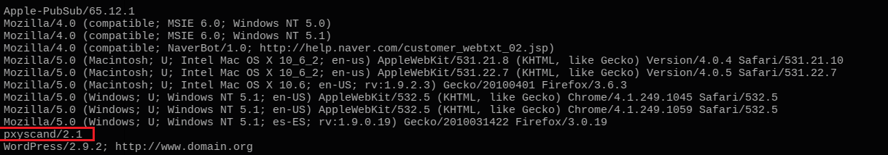
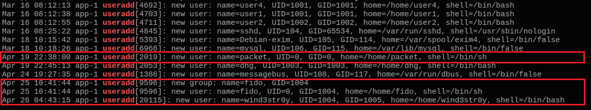

* ID del Incidente / Ticket: INC-2026-0424
* Fecha/Hora de Detección: 2026-04-24 20:00:00 UTC
* Severidad: Crítica
* Host(s) / Usuarios Afectados: app-1 / cuentas root y mysql
* Fuente de Detección: Revisión de logs de sistema (SSH, auth, sudo, dpkg, apache)
* Analista Asignado: SOC Analyst L2

Resumen Ejecutivo
-----------------
Un atacante externo comprometió el servidor de producción app-1 mediante un ataque de fuerza bruta por SSH, logrando acceso a la cuenta root. Según investigaciones en fuentes oficiales, la causa raíz fue una configuración insegura en el servicio SSH (PermitRootLogin yes), documentada en las directivas de OpenSSH (https://www.openssh.com/sshd_config.5.html). El impacto es crítico: el actor de amenazas tomó control total, creó cuentas ocultas con privilegios UID 0, modificó el firewall e instaló herramientas C2. El host fue aislado.

Línea de Tiempo del Ataque
--------------------------
* 18-Apr 18:22:09 UTC - Primer intento de fuerza bruta contra root.
* 19-Apr 05:41:44 UTC - Inicio de sesión exitoso desde IPs externas.
* 19-Apr 22:38:00 UTC - Creación de cuentas no autorizadas.
* 19-Apr 22:54:00 UTC - Instalación de entorno de compilación.
* 19-Apr 23:27:00 UTC - Instalación de utilidades alien y rpm.
* 19-Apr 23:38:00 UTC - Despliegue de bot IRC eggdrop.
* 24-Apr 19:25:37 UTC - Modificación de iptables.
* 24-Apr 19:38:15 UTC - Instalación de nmap v4.53-3.

Indicadores de Compromiso (IoCs)
--------------------------------
- IPv4: 61.151.246.140 (IP origen del ataque de fuerza bruta SSH)
- IPv4: 219.150.161.20 (IP origen con autenticación exitosa como root)
- User-Agent: pxyscand/2.1 (Herramienta de escaneo de proxies detectada en tráfico web)
- Cuenta Local: packet, fido, wind3str0y (Usuarios creados con UID 0 para persistencia)
- Herramienta: nmap 4.53-3 (Binario instalado para reconocimiento de red)

Análisis Técnico y Evidencia
----------------------------
La intrusión comenzó con un ataque masivo de autenticación fallida. Evidencia extraída del archivo referenciado como Captura1.jpg:

$ grep "Failed password" auth.log
Apr 18 18:22:09 app-1 sshd[5266]: Failed password for root...

El acceso se consolidó desde direcciones externas. Evidencia extraída del archivo referenciado como Captura2.PNG:

$ grep "Accepted password" auth.log
...

Alteración de configuración local para modificar reglas de firewall, permitiendo tráfico en puertos inusuales (ej. 2424). Evidencia extraída del archivo referenciado como Captura3.PNG:

$ grep "iptables" auth.log
...

Instalación de herramientas desde repositorios. Evidencia extraída del archivo referenciado como Captura5nmap.PNG:

$ grep "installed" dpkg.log
...

Tráfico web anómalo asociado a escaneos. Evidencia extraída del archivo referenciado como Captura6pxhain.PNG:

$ awk -F'"' '{print $6}' apache2/www-access.log | sort | uniq
...

Creación sistemática de perfiles para persistencia. Evidencia extraída del archivo referenciado como Captura33.PNG:

$ grep "useradd" auth.log
...

Vulnerabilidad crítica en bases de datos locales comprobada mediante la siguiente consulta:

$ SELECT user, host, password FROM mysql.user WHERE user='root' AND password='';

Mapeo de Técnicas (MITRE ATT&CK)
--------------------------------
Según fuentes oficiales del framework MITRE (https://attack.mitre.org), se identifican las siguientes tácticas y subtécnicas:
| ID MITRE | Técnica | Descripción del Caso |
| --- | --- | --- |
| [T1110.001](https://attack.mitre.org/techniques/T1110/001/) | Password Guessing | Intentos masivos sobre el puerto 22. |
| [T1078.003](https://attack.mitre.org/techniques/T1078/003/) | Local Accounts | Uso de credenciales root obtenidas para operar. |
| [T1098](https://attack.mitre.org/techniques/T1098/) | Account Manipulation | Creación de usuarios con privilegios elevados (UID=0). |
| [T1562.004](https://attack.mitre.org/techniques/T1562/004/) | Disable or Modify System Firewall | Modificación de iptables vía sudo para permitir conexiones C2. |
| [T1046](https://attack.mitre.org/techniques/T1046/) | Network Service Discovery | Instalación y uso de nmap 4.53-3. |
| [T1071.001](https://attack.mitre.org/techniques/T1071/001/) | Web Protocols | Uso de IRC (eggdrop) para Comando y Control. |

Acciones de Respuesta, Remediación y Ajustes
--------------------------------------------
Acciones de Contención Ejecutadas:
Host app-1 aislado de la red. IPs bloqueadas en el firewall perimetral.

Acciones de Erradicación Sugeridas:
Reconstruir el servidor desde una imagen segura. Deshabilitar PermitRootLogin en sshd_config. Establecer contraseñas para cuentas de MySQL.

Acciones de Detección Futura:
Configurar reglas SIEM para umbrales de fallos SSH (10 fallos/minuto). Integrar SOAR para bloqueo preventivo de IPs y alertas de creación de cuentas.
